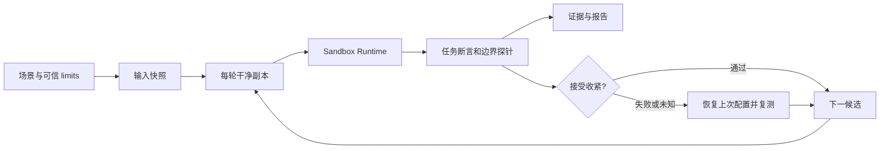

# 架构与搜索

## 模块

| 文件 | 责任 |
| --- | --- |
| cli.ts | 参数、信号、退出码、doctor 内置项目 |
| src/config.ts | 严格配置校验、路径别名和可信读写权限上限 |
| src/filesystem.ts | 快照、路径检查、哈希、文件变化及原子 JSON 写入 |
| src/backend.ts | macOS 后端、固定约束、清理环境变量和 SRT 生命周期 |
| src/process.ts | 参数引用、有限输出、超时、取消及进程组清理 |
| src/probes.ts | 假数据、宿主对照、本地 TCP 端点及沙箱探针 |
| src/assertions.ts | 沙箱外的声明式产物验证 |
| src/junit.ts | 受限 JUnit XML 解析和用例结果验证 |
| src/discovery.ts | 有界目录枚举、跨基线观察合并和自动规则 |
| src/read-discovery.ts | 有界项目输入枚举、文件/目录读取候选及来源 |
| src/diagnostics.ts | 拒绝证据解析、路径别名和失败解释 |
| src/search.ts | 候选生成、接受、恢复复测和停止条件 |
| src/engine.ts | 实验编排、预算、最终验证及报告 |
| src/regression.ts | 历史规则导入、当前输入冻结、宽规则对照、有限补充及回归汇总 |
| src/install.ts | npm 锁定输入检查、缓存条件、固定安装参数、输入不变检查与传输失败分类 |
| src/sandbox-supervisor.ts / src/sandbox-worker.ts | 独立后端进程、真实结果 IPC、任务进程组、超时取消和有界代理清理 |

编排器串行执行实验。每次后端调用在独立 worker 中 initialize、执行、reset，使用唯一 invocation_id 关联拒绝事件；SRT 的 singleton 不跨调用共享。父进程记录任务进程组并控制超时/取消，等待 worker 真正退出后才继续。

任务完成的结果通过 IPC 发送后，清理最多等待 1 秒；CONNECT 对端不结束导致 reset 卡住时，终止这个 worker 的进程组并确认退出。父进程随后删除该 worker 独立、受保护的短路径 socket 目录。真实任务结果仍保留，backend_cleanup 明确记录 forced；缺少真实结果、worker 崩溃或清理报错保持 unknown。命令超时或取消后也会终止已记录的任务进程组，不能留下后台任务再标为通过。每次创建 worker 会增加进程启动开销，保证代理状态不会跨调用残留。

## 历史规则回归

check 导入经过验证的最终授权及其读取文件/目录类型，用当前任务定义执行。编排器只冻结当前输入一次，engine 的内部 frozenInput 接口克隆并核对哈希；原项目、共同快照、历史报告和回归汇总仍处于保护路径中。安装基线还导入域名，检查当前可信上限、对照覆盖和缓存模式；网络拒绝可生成受限补充。

旧规则通过就结束该任务；否则运行配置声明的较宽策略，再重新确认旧失败及宽策略恢复。两边都失败保持 unresolved_failure；超时、边界问题、文件类型变化和不稳定结果记为 inconclusive。

修复候选来自受限的拒绝路径及模块错误，先单次运行，再按 repetitions 完整验证。失败后恢复已通过的宽规则。新写目录需要预建时，先使用同一准备列表重新建立旧规则/宽规则对照。阶段报告保留真实 trial，回归报告单独记录环境、输入与授权差异。详见 [回归检查](regression-checks.md)。

## 一个 trial 的执行顺序

1. 从冻结快照克隆工作区，新建缓存和临时目录；warm 安装从固定输入种子克隆独立 npm 缓存。
2. 创建写入准备目录，移除旧产物；读目标必须存在。explicit 模式创建只写保护的假读文件，冻结读目标类型。
3. 检查夹具存在、内容正确、对照写入可行、网络端点健康。
4. 在候选策略下运行读取、写入、报告保护和网络探针。
5. 前置探针全部通过后，若有 install，按候选域名执行固定 npm ci --ignore-scripts，检查锁文件/清单未变并复查边界；随后重新关闭域名授权、验证断网探针，再执行任务。安装失败不执行后续命令。
6. 回收正常进程组后，在宿主上运行内置产物断言。
7. 使用同一策略再执行探针，对照检查再次确认环境健康。
8. 记录工作区、缓存和临时目录的文件变化、生效配置、有限日志和可获得的拒绝事件；基线还记录有界目录结构。

SRT 在包装命令中设置默认 TMPDIR。执行器在沙箱内以引用过的 env 参数重新设置为本轮 @tmp，避免默认共享临时目录覆盖独立临时目录；/tmp/claude 的写权限继续被拒绝。

任务与探针分别启动，每个阶段使用相同文件授权与对应网络策略。安装阶段允许候选域名，主任务阶段域名列表为空；各自保留前后探针及生效策略。探针同时验证直接 TCP 拒绝与经认证代理访问保留域名得到 403。

## 搜索方式

每个任务先独立验证初始策略。全部基线通过后，自动合并各任务所有通过基线的观察，生成输出目录组合、目录结构和拒绝线索规则，且不超过可信上限。只在这一阶段生成自动规则，搜索期间保持固定，避免环境准备状态随失败日志改变。

若自动规则需要预建目录，用冻结的目录列表重新确认基线。确认失败时停止。确认通过后，写搜索按手工规则、自动规则尝试父目录缩小，再成组或逐个撤销授权；所有比较使用相同的目录准备方式。导出配置保留准备列表。

候选通过时更新当前配置，并尝试尚未处理的操作；同级授权可以成组撤销，失败恢复后拆分。一轮内已尝试的操作延后到下一轮复查，直到完整一轮没有接受修改，或最后一次修改后剩余候选已全部实际比较。同一轮的相同失败组合可用作拆分线索，单独关联证据；下一轮清空。权限变化可能改变程序路径，不能永久保留旧失败结论。详见 [搜索效率](search-efficiency.md)。

读取搜索依据任务启动前的输入树生成候选，先删除授权再拆分保留的目录，避免展开不需要的依赖包。读权限接受变化后重新搜索写权限；写权限变化时再复查读取，没有变化则跳过已经完成的读取搜索。直到联合候选不再接受或达到限制。准备列表和读取候选在搜索前冻结；实际文件/目录类型在每轮开始时冻结，用于任务和前后探针。

候选失败或无法判定时，以之前的配置恢复复测。如果恢复也不通过，停止该轮搜索并记为不稳定，避免将环境错误归因于权限。

安装场景先撤销精确域名，再搜索写权限，不生成通配符或从锁文件自动放宽。写权限变化后重新搜索域名；域名未变时不重复已完成的写搜索。冷缓存候选、恢复和最终验证都重新安装；暖缓存始终由相同种子生成且 npm --offline。超时、传输、DNS、TLS 和注册表 5xx 属于 unknown；网络候选的安装失败没有捕获到独立域名拒绝也记 unknown。恢复通过不会将 unknown 改成必要域名结论。

没有候选、达到次数/时间预算或恢复不稳定时终止搜索。最后从干净状态完整重复所有任务。搜索只试验生成或声明的有限操作，没有穷举目录子集，也没有求全局最小解。枚举上限可能省略目录；瞬时操作可能不出现在文件差异中，两者都在报告中说明。

删除一个仍被祖先授权覆盖的规则，会记录为配置简化，不计为实际授权范围缩小。

## 三个结果维度

任务退出状态、产物断言和边界检查分别保存在 evidence 中。汇总 verdict 为：

- pass：进程正常完成且退出码 0，全部断言和探针通过。
- fail：正常完成的任务或明确边界断言未满足。
- unknown：超时、取消、输出超限、基础设施异常、探针证据缺失或无法解释。

拒绝事件用于解释结果，不单独决定需要放宽权限。某次访问被拒绝，但任务仍然完成时，拒绝可能是可选行为。拒绝事件为尽力收集，日志延迟或系统权限可能造成缺失。

diagnosis 单独分类执行未完成、边界问题、退出非零且捕获到权限拒绝、普通命令失败、退出零但断言失败。拒绝线索保留来源（系统沙箱日志或任务 stderr）及可映射的路径别名。Markdown 关联本次规则变化与恢复 verdict，缺失拒绝日志时明确说明证据不足；不将任意任务错误归因为权限。

实验 status 与 search_complete 也是独立维度。搜索预算用完后，一个已经完整重测的策略仍可标记 verified，同时 search_complete 为 false。恢复不稳定、用户中断、清理失败或最终重测失败时为 incomplete，不能输出推荐配置。

## 证据与重现

每次运行有单独 JSON 文件。顶层报告在每个 trial 和搜索决策后更新；JSON 使用临时文件加 rename，减少写入中断造成的损坏。Markdown 为便于阅读的派生文件。

输入哈希覆盖复制的文件内容、文件模式、相对路径、目录以及内部符号链接目标。配置、limits 和包含读写范围、读取目标类型与目录准备状态的可变策略也分别计算哈希。哈希帮助对照实验条件，不能替代可信存储或第三方签名。

每轮工作区通过 forkSnapshot 创建。macOS 使用系统 cp -c 的 clonefile 写时复制，Linux 文件工具测试使用 Node 的 reflink 优先选项；文件和目录仍独立，绝不使用硬链接。磁盘不支持克隆时，复制工具回退到复制字节。evidence.workspace_fork 记录策略与创建耗时；策略名称表示请求克隆，不能证明所有文件实际共享了物理块。输入冻结仍只进行一次完整内容读取和哈希，文件枚举、差异哈希、目录创建/删除的成本仍然存在。详见 [快照工作区](snapshot-workspaces.md)。
