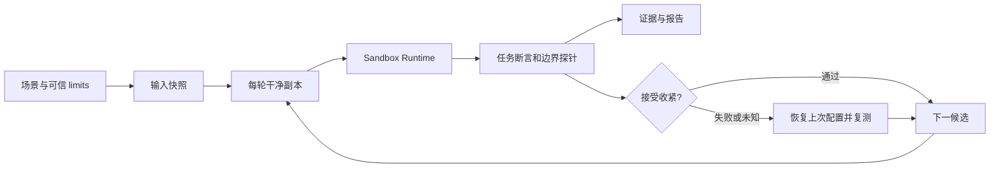

# 架构与搜索

## 模块

| 文件 | 责任 |
| --- | --- |
| cli.ts | 参数、信号、退出码、doctor 内置项目 |
| src/config.ts | 严格配置校验、路径别名和可信写权限上限 |
| src/filesystem.ts | 快照、路径检查、哈希、文件变化及原子 JSON 写入 |
| src/backend.ts | macOS 后端、固定约束、清理环境变量和 SRT 生命周期 |
| src/process.ts | 参数引用、有限输出、超时、取消及进程组清理 |
| src/probes.ts | 假数据、宿主对照、本地 TCP 端点及沙箱探针 |
| src/assertions.ts | 沙箱外的声明式产物验证 |
| src/search.ts | 候选生成、接受、恢复复测和停止条件 |
| src/engine.ts | 实验编排、预算、最终验证及报告 |

后端有全局状态，因此一个进程内串行执行。意外并发调用会被拒绝。每次调用都 initialize、执行、reset，并用唯一 invocation_id 关联拒绝事件。

## 一个 trial 的执行顺序

1. 从冻结快照复制工作区，新建空缓存和临时目录。
2. 创建初始及候选授权目录，移除断言指向的旧产物。
3. 检查夹具存在、内容正确、对照写入可行、网络端点健康。
4. 在候选策略下运行读取、写入、报告保护和网络探针。
5. 前置探针全部通过后，执行任务。
6. 回收正常进程组后，在宿主上运行内置产物断言。
7. 使用同一策略再执行探针，对照检查再次确认环境健康。
8. 记录工作区文件变化、生效配置、有限日志和可获得的拒绝事件。

任务与探针分别启动，但使用同一可变授权和固定后端配置。改变执行程序本身不改变允许范围。

## 搜索方式

每个任务先独立验证初始策略。全部基线通过后，按声明顺序尝试父目录缩小，再逐个撤销写授权。

候选通过时更新当前配置，并重新生成全部候选。这样不会把旧配置下失败的撤销，直接当成新配置下也必然失败。权限变化可能改变程序路径，算法不依赖任务成功的单调性。

候选失败或无法判定时，以之前的配置恢复复测。如果恢复也不通过，停止该轮搜索并记为不稳定，避免将环境错误归因于权限。

没有候选、达到次数/时间预算或恢复不稳定时终止搜索。最后从干净状态完整重复所有任务。搜索中只试验有限的声明式操作，没有穷举目录子集，也没有求全局最小解。

删除一个仍被祖先授权覆盖的规则，会记录为配置简化，不计为实际授权范围缩小。

## 三个结果维度

任务退出状态、产物断言和边界检查分别保存在 evidence 中。汇总 verdict 为：

- pass：进程正常完成且退出码 0，全部断言和探针通过。
- fail：正常完成的任务或明确边界断言未满足。
- unknown：超时、取消、输出超限、基础设施异常、探针证据缺失或无法解释。

拒绝事件用于解释结果，不单独决定需要放宽权限。某次访问被拒绝，但任务仍然完成时，拒绝可能是可选行为。拒绝事件为尽力收集，日志延迟或系统权限可能造成缺失。

实验 status 与 search_complete 也是独立维度。搜索预算用完后，一个已经完整重测的策略仍可标记 verified，同时 search_complete 为 false。恢复不稳定、用户中断、清理失败或最终重测失败时为 incomplete，不能输出推荐配置。

## 证据与重现

每次运行有单独 JSON 文件。顶层报告在每个 trial 和搜索决策后更新；JSON 使用临时文件加 rename，减少写入中断造成的损坏。Markdown 为便于阅读的派生文件。

输入哈希覆盖复制的文件内容、文件模式、相对路径、目录以及内部符号链接目标。配置、limits 和可变策略也分别计算哈希。哈希帮助对照实验条件，不能替代可信存储或第三方签名。

每轮完整复制依赖可能较慢，这是首版为隔离状态作出的取舍。后续优化可以考虑可信只读依赖挂载或写时复制，但必须继续验证跨轮污染问题。
